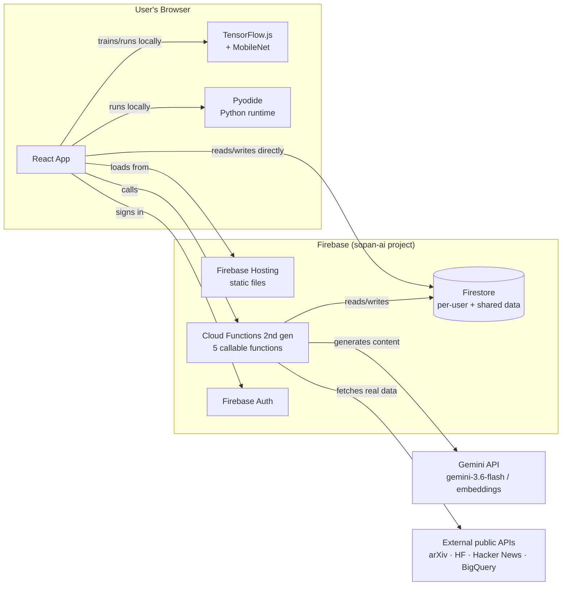
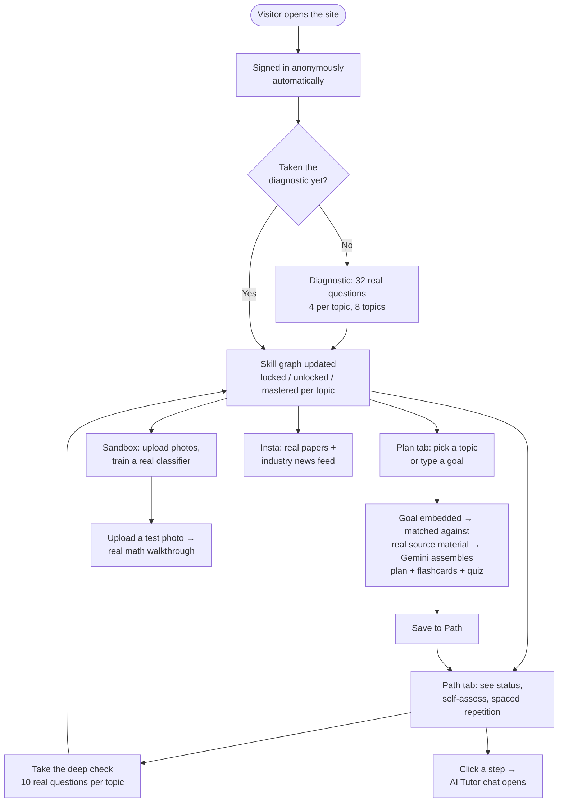

# Sopan AI

**Live app**: https://sopan-ai.web.app
**Built for**: Patchamomma 2026
**One-liner**: An adaptive AI/ML learning platform that diagnoses your real skill level, builds a personalized RAG-grounded curriculum, and lets you train a real image classifier in-browser to watch machine learning actually happen — instead of just reading about it.

> A note on this document: every example below (questions, generated plan content, chat replies) is a real output captured from the actual running app, not invented for illustration. "Sopan" (Sanskrit/Hindi/Marathi: staircase) reflects the core idea — climb one real step at a time, not a fixed syllabus.

---

## Table of contents

1. [Why this exists](#why-this-exists)
2. [Tech stack](#tech-stack)
3. [Architecture](#architecture)
4. [App flow](#app-flow)
5. [Every feature, in detail](#every-feature-in-detail)
6. [Data sources — what's real and where from](#data-sources--whats-real-and-where-from)
7. [Running it locally](#running-it-locally)
8. [Deploying](#deploying)
9. [Project layout](#project-layout)

---

## Why this exists

Most "learn AI" platforms ask you to self-report a skill level, then hand everyone the same fixed syllabus regardless of the answer. Sopan AI diagnoses instead of asking — a real placement test drives a per-topic skill graph, not one score — and its centerpiece is a sandbox where you train an actual model and watch the real math happen, not a canned animation of one.

This was built for Patchamomma 2026, but the actual motivation behind it is broader than the competition: **learning — and especially sustainable, self-paced learning — should be accessible to anyone**, not gated by cost, prior background, or a rigid one-size-fits-all curriculum. The same skill-graph approach that adapts to an experienced developer brushing up on transformers also works for a complete beginner starting with Python basics — nothing in the platform assumes a floor of prior knowledge, and nothing punishes someone for already knowing more than average. A curious kid learning their first "what is a variable" and a working adult picking up applied LLMs can both use the same app, at their own actual level, for free.

Concretely, a few things in the build reflect that goal directly (see [Accessibility](#accessibility--and-its-real-limits) for what's actually been validated and what hasn't):
- **Free to use** — anonymous sign-in on load, no account, no paywall, ever
- **Dark mode**, for low-light use and reduced eye strain
- **A dyslexia-friendly font toggle**
- **A colorblind-safe palette toggle**
- **Optional Google sign-in** only if you want progress to follow you across devices — never required

## Tech stack

| Layer | Technology | What it's used for |
|---|---|---|
| Frontend | React 19 + Vite | The whole UI, six tabs, no server-side rendering |
| Backend | Firebase Cloud Functions (2nd gen, Node 24) | 5 callable functions — plan assembly, feed curation, question generation, tutor chat, sandbox narration |
| Database | Firestore | Per-user skill graph, saved plans, quiz scores; shared content chunks for RAG |
| Auth | Firebase Authentication | Anonymous by default, optional upgrade to Google sign-in |
| Hosting | Firebase Hosting | Static site, global CDN |
| AI | Gemini API (`gemini-3.6-flash`, `gemini-embedding-2`) | Every generated explanation, quiz, flashcard, plan, and chat reply |
| In-browser ML | TensorFlow.js + MobileNet | Real transfer-learning image classifier, trained live in the user's browser |
| In-browser code execution | Pyodide (Python via WebAssembly) | The Practice tab — real Python, no server round-trip |
| External data | HuggingFace datasets-server, BigQuery public datasets, arXiv API, Hugging Face Daily Papers, Hacker News (Algolia) API | Real benchmark questions and a real current-events feed — see [Data sources](#data-sources--whats-real-and-where-from) |

## Architecture



Two things worth understanding about this shape:
- **The Sandbox tab does zero server work.** Training the image classifier happens entirely in the visitor's own browser via TensorFlow.js — no upload, no server GPU, no cost per training run.
- **Firestore is touched two ways**: directly from the browser for simple per-user reads/writes (checking off a plan step, saving self-assessment), and through Cloud Functions when a write needs to be paired with an AI call (assembling a plan, generating quiz questions) or a RAG vector search.

## App flow



---

## Every feature, in detail

### 1. Diagnostic

A real 32-question placement test — 4 questions for each of 8 topics (Python Basics → Applied LLMs & RAG), pulling from three real sources per topic: hand-authored questions, genuine MMLU/AGIEval benchmark items (fetched live via HuggingFace's `datasets-server` API), and Gemini-generated questions (cached per topic in Firestore so they're not regenerated every time).

**Real example question** (MMLU, `cais/mmlu`):
> *"What's the key difference between a list and a tuple?"*
> Options included "Lists are mutable (can change), tuples are immutable" — the correct answer.

No early stopping by default — but you can end it whenever you want (see below). Each topic's score (pass threshold: 3/4) sets that topic's status directly in your skill graph — you can even skip ahead if you already know a later topic, since each topic is scored independently rather than gating on a single overall level.

**End test now**: a button is visible throughout the test. Clicking it shows a confirmation ("End here? N/8 topics scored so far") before finalizing — topics you've fully completed are scored and saved; the topic you were mid-way through is dropped rather than counted as a failure (a partial 1/4 or 2/4 isn't a fair score, so it's simply left unassessed, which the skill graph treats the same as "not yet taken this topic").

### 2. Path

Your per-user skill graph, seeded the first time you sign in (mirrors the 8-topic sequence). Each topic shows:
- Status: 🔒 locked / ○ unlocked / ✓ mastered
- Self-assessment chips: **Confident** / **Shaky** / **Needs revision** — tapping "Needs revision" immediately schedules that topic due for review today via the SM-2 spaced-repetition algorithm (the same algorithm real flashcard apps like Anki use)
- **"Take the deep check →"** — a real 10-question mixed-source quiz (same three sources as the Diagnostic), 80% to pass. Passing re-masters the topic and cascades to unlock the next one; failing flags it for revision and schedules a review.
  - **Go back**: same pattern as the Diagnostic — a button that lets you leave mid-quiz with a confirmation ("Leave now? This attempt won't be scored"), no penalty, nothing is recorded.
- Real StackOverflow examples appear after a deep check, pulled from BigQuery's public `stackoverflow` dataset — genuine developer questions related to the topic, with real upvote scores.

Your saved Plans (see below) are also tracked here, each with the same Steps / Flashcards / Quiz tabs as the Plan tab, so Path is where you come back to actually review and re-test yourself over time, not just check a box once.

### 3. Practice

Real Python, compiled to WebAssembly via Pyodide, running entirely in your browser. Type code, hit run, see real output — no server round-trip, no sandboxing cost, works offline once loaded.

### 4. Plan

Pick one of 8 topic chips, or type your own goal. What happens next is a real RAG (retrieval-augmented generation) pipeline, not a raw LLM prompt:

1. Your goal is turned into a real embedding vector (`gemini-embedding-2`)
2. That vector is matched against a Firestore vector index of real, pre-ingested source material (fast.ai lessons, Google's ML Crash Course, etc.) via `findNearest`
3. Gemini assembles a plan **grounded strictly in the matched material** — explicitly instructed not to add anything the sources don't support

**Real example output** (goal: "neural networks"):
> Plan title: *"Understanding Core Concepts of Machine Learning Models"*
> Step: *"Understand Loss and Parameter Optimization"* — "Study loss as a numerical metric measuring how wrong predictions are, and learn that model training aims to find parameters that minimize loss across training data."
> Source: `https://developers.google.com/machine-learning/crash-course/linear-regression/loss`

Each step is **click-to-expand** — it's a real 3-5 sentence lesson (not just a link out), plus the option to open the **AI Tutor**.

The same generation call also produces:
- **5 flashcards** — a real animated 3D flip-card deck (question on front, answer on back)
- **5-question quiz** — options shuffled (see the note on this under "Honest things worth knowing" below), immediate feedback with an explanation, a final score, retake anytime

Save the whole thing to Path with one click.

### 5. AI Tutor (inside Plan / Path)

Click "💬 Chat with an AI tutor about this" on any step and a modal chat window opens. Unlike the plan builder, this isn't RAG-grounded — it's a real conversational tutor, instructed to draw on its own knowledge, explain clearly, and flag genuine uncertainty rather than bluff.

**Real example opening message** (topic: "Learn How Machine Learning Solves Problems"):
> *"Think of traditional programming like writing a strict recipe: if you forget a rule, the whole dish is ruined. Machine learning flips this on its head by acting more like a chef learning through hundreds of taste tests... You see this exact process in production today with Gmail's spam filter."*

Quick actions (no typing needed): **📋 List key subtopics**, **🌍 Real-world example**, **🔎 Simplify that**. Free-form follow-up questions work too — asked for "a completely different example" and got a genuinely different one back (house price prediction via Zillow's "Zestimate," not a repeat of the spam example). The conversation uses Gemini's native multi-turn threading (`previous_interaction_id`) and Google Search grounding, so it can pull in current information rather than only its training data. Closing the chat window doesn't lose the conversation — reopening it picks up exactly where you left off.

### 6. Insta

A merged current-events feed — not just research papers:
- **arXiv** — raw preprint firehose
- **Hugging Face Daily Papers** — community-upvoted, higher signal
- **Hacker News** (via its official Algolia search API) — real trending industry stories: launches, funding, acquisitions. This is what actually catches business news a papers-only feed would miss.

Filter tabs (All / Research / Industry news), source badges, and flip-to-reveal flashcards on paper items. An **"Explore more sources"** section lists 16 curated links (LMSYS Chatbot Arena, HF Open LLM Leaderboard, Papers with Code, the major labs' blogs, r/MachineLearning, etc.) — real sources that don't have a free public API to pull live, so they're honest outbound links instead of a fake integration.

### 7. Sandbox

Upload a handful of your own photos for two classes (e.g. "Cats" vs "Dogs"), and train a real image classifier, live, in your browser:

- **MobileNet** (frozen, pretrained) turns each photo into a 1,024-number embedding
- A small trainable 2-layer network sits on top and actually learns during training — rendered as a real fully-connected graph (not decorative dots) with particles animating along every edge while training runs
- **"Try it on a new photo"** walks through the actual math, step by step, using the model's real trained weights: the embedding → a real weighted-sum formula with real numbers → real hidden-layer activations → real raw logits → the softmax formula computing real probabilities → the final answer. A "you are here" pipeline strip tracks progress through the 5 steps, with a replay button.
- If either class has fewer than 5 training photos, an honest warning explains why a tiny sample can be confidently wrong (it's pattern-matching on whatever was common across those few photos — background, lighting, pose — not necessarily the thing you care about).

### Cross-cutting

- **Auth**: anonymous on first load, optional "Save your progress — sign in with Google" upgrade that preserves all existing data
- **Theming**: light/dark (respects system preference, overridable), dyslexia-friendly font toggle, colorblind-safe palette toggle — see [Accessibility](#accessibility--and-its-real-limits) below
- **Cost tracker**: a real ₹0.00 in the header, since everything runs on free tiers by design
- **Responsive**: a real website layout (sticky top nav, content reflows for mobile), not a phone-app frame squeezed into a browser

## Accessibility — and its real limits

Two toggles exist in the header, next to the theme switch:

- **"Aa" — dyslexia-friendly font**: swaps body and heading text to OpenDyslexic, a font specifically designed with weighted bottoms and varied letter shapes intended to reduce letter-swapping/flipping, and increases letter-spacing and line-height.
- **"◐" — colorblind-safe palette**: swaps the app's two semantic signal colors (the "mastered/success" green and the "error/danger" red) to the Okabe-Ito blue/orange pair, a palette specifically designed to stay distinguishable across the common forms of color vision deficiency, instead of the red/green pairing that's the classic failure case.

**Honestly**: both are good-faith implementations of established, published accessibility guidance — not something built or validated by an accessibility expert, and not tested with real users who have dyslexia or color vision deficiency. OpenDyslexic itself has mixed evidence in the research literature on how much it actually helps reading speed/comprehension versus a plain, well-spaced sans-serif — it's offered as an easy, free option to try, not a proven fix. Treat both toggles as "worth having and easy to turn on," not as a validated accessibility certification.

---

## Data sources — what's real and where from

| Source | Used for | Access method |
|---|---|---|
| `cais/mmlu`, `hails/agieval-*` (HuggingFace) | Real benchmark questions in Diagnostic + Deep Check | `datasets-server.huggingface.co` REST API, no auth |
| BigQuery `bigquery-public-data.stackoverflow` | Real developer Q&A shown after a deep check | BigQuery public dataset, `roles/bigquery.jobUser` |
| arXiv | Research preprints in Insta | `export.arxiv.org` public API |
| Hugging Face Daily Papers | Curated papers in Insta | `huggingface.co/api/daily_papers`, public |
| Hacker News | Industry news in Insta | Algolia's official HN search API, public |
| Course material (fast.ai, Google ML Crash Course, etc.) | Grounding for Plan's RAG pipeline | Pre-ingested once into Firestore's vector index via `scripts/ingest.cjs` |

Nothing in this app is synthetic or invented data presented as real. Where the app can't verify something (Insta's Gemini-written summaries, the AI Tutor's conversational answers), it's explicitly instructed to stay grounded in what it was actually given, or to flag uncertainty rather than assert confidently.

---

## Honest things worth knowing

A few real issues found and fixed during development, worth knowing about if you're reviewing the code:

- **Gemini reliably lists the correct quiz answer first.** Confirmed live across the Diagnostic, Deep Check, and Plan quiz — left unfixed, "always pick option A" would be a working way to fake mastery. All three now shuffle each question's options.
- **React StrictMode's dev-mode double-effect-invocation** was causing the Sandbox's narration and the Insta feed's initial load to fire two real Gemini calls instead of one on every mount — a state-only guard wasn't enough to prevent it (the second call runs before the first `setState` commits). Fixed with `useRef` guards.
- **Firestore write rules** now cap document size at 200KB — since this app uses Anonymous Auth (any visitor gets a valid session on page load), an unbounded write size was a real, if modest, cost-exhaustion risk once real billing was attached.

---

## Running it locally

```bash
npm install
npm run dev              # Vite dev server, http://localhost:5173

# in a second terminal, for backend features (Plan, Insta, Sandbox narration, Tutor chat):
cd functions && npm install
firebase emulators:start --only functions
```

## Deploying

See [DEPLOYMENT.md](./DEPLOYMENT.md) for the full walkthrough. Short version:
```bash
npm run build
firebase deploy --only firestore:rules,functions,hosting
```

To take the live site offline/online without touching functions or data:
```bash
./scripts/hosting-off.sh   # visitors get a 404
./scripts/hosting-on.sh    # back live
```

## Project layout

```
src/
  App.jsx                  Root — tab navigation, theme, auth state
  DiagnosticQuiz.jsx        Diagnostic tab
  SkillMap.jsx              Path tab's skill graph
  TopicDeepCheck.jsx        Path tab's deep-check quiz
  PlanAssembly.jsx           Plan tab
  PlanTracker.jsx            Path tab's saved-plans section
  StepTutorChat.jsx          AI Tutor modal (shared by Plan + Path)
  FlashcardDeck.jsx          Reusable flip-card deck
  PlanQuiz.jsx               Reusable quiz component
  LearnFeed.jsx              Insta tab
  MLSandbox.jsx / tfClassifier.js / SandboxCharts.jsx   Sandbox tab
  CodeBlock.jsx               Practice tab (Pyodide)
functions/
  index.js                  All 5 Cloud Functions
scripts/
  ingest.cjs, seed.cjs, fetch*.cjs   One-off admin scripts that populated Firestore's shared collections
firestore.rules             Security rules
```
